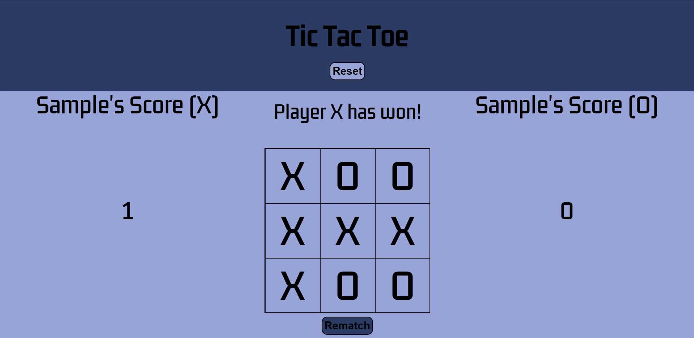

# Tic-Tac-Toe
→ [Live Demo](https://rukhan4.github.io/tic-tac-toe/)

## Table of contents
* [Description](#description)
* [Technologies](#technologies)
* [Setup](#setup)
* [Live Example](#live)

## Description
This project entails a GUI Tic-Tac-Toe game playable from the browser

### Features: 

1) Accepts form data to show player names and updates the webpage content throughout
2) Utilizes an algorithm to decide who wins and keeps track of the score
3) Ensures only valid moves are playable 


## Technologies
Project is created with:
* Javascript 1.7 (chrome)
* HTML5
* CSS3  
	
## Setup
To run this project, install it locally as shown:

Click the ``fork`` button in this repository. This allows the user to create a remote repository in their Github. In order to modify this project:

1) Copy the Git repository URL for your new Fork

2) On the terminal, in your project directory, add a remote:

``git remote add fork <repo-fork-url>``

3) Ensure your fork is up-to-date in relation to the original project

```git checkout master```

```git pull -rebase origin master```

4) Remove the existing upstream for master; Setup upstream to publish your commits to your Fork

```git branch --unset-upstream master```

```git push -u fork master```

## Live

